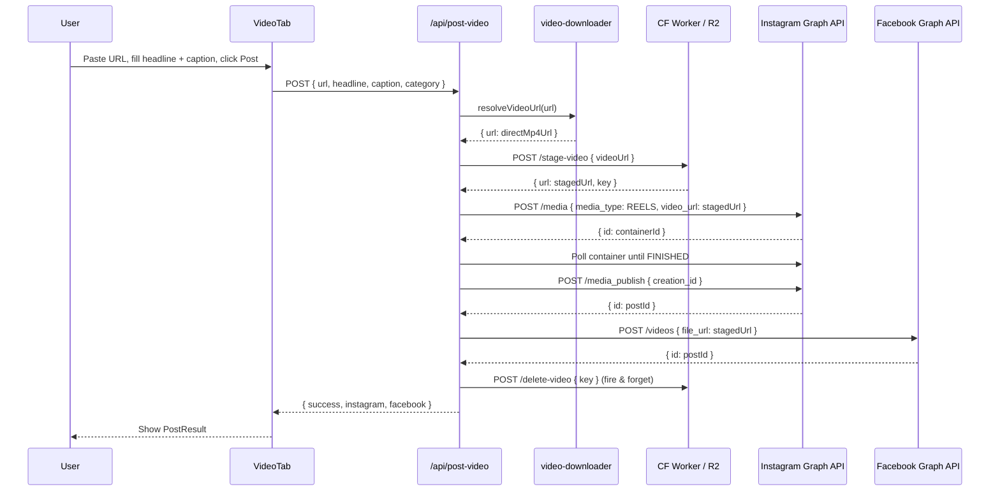
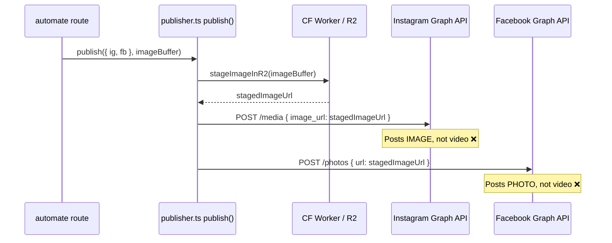

# Design Document: Composer Video Posting Fix

## Overview

The Composer page (`src/app/composer/page.tsx`) has a `VideoTab` and `SocialImportTab` that are wired to `/api/post-video`, which correctly stages and posts videos. However, the root cause of "posting images instead of videos" is that `publisher.ts` — the shared publish utility — only handles **image** posting (`image_url` to IG, `/photos` to FB). When the automate pipeline calls `publisher.ts` it posts a branded thumbnail image, not the video. The Composer's `VideoTab` bypasses `publisher.ts` and calls `/api/post-video` directly, which does post video correctly — but the `VideoTab` currently fetches a thumbnail URL via `/api/preview-url` and that response's `imageBase64` field is what gets displayed, creating confusion. The real fix is to ensure the `VideoTab` flow is clearly video-first end-to-end, and that `publisher.ts` gains a proper video publish path so all callers are consistent.

The three affected surfaces are:

1. `VideoTab` in the Composer — calls `/api/post-video` (already correct, but UX is confusing)
2. `SocialImportTab` in the Composer — calls `/api/post-video` with a resolved direct video URL (correct)
3. `publisher.ts` — only posts images; has no video path, so any caller that uses it for video content silently posts a thumbnail image instead

---

## Architecture

```mermaid
graph TD
    A[Composer Page] --> B[VideoTab]
    A --> C[SocialImportTab]
    A --> D[CarouselTab]

    B -->|POST url + headline + caption| E[/api/post-video]
    C -->|POST resolved videoUrl + headline + caption| E

    E --> F[resolveVideoUrl\nvideo-downloader.ts]
    E --> G[stageVideo → CF Worker /stage-video → R2]
    E --> H[generateImage → branded thumbnail]
    E --> I[IG Graph API\nmedia_type: REELS\nvideo_url: stagedUrl]
    E --> J[FB Graph API\n/videos\nfile_url: stagedUrl]

    K[automate.ts / publisher.ts] -->|BUG: posts image_url| L[IG Graph API\nmedia_type: IMAGE]
    K -->|BUG: posts /photos| M[FB Graph API\n/photos]
```

The Composer's own `/api/post-video` route is already correct. The bug manifests when `publisher.ts` is used — it only knows how to post images. Any automated flow that generates a branded thumbnail and calls `publish()` ends up posting the image, not the video.

---

## Sequence Diagrams

### VideoTab Happy Path (current — already correct)



### publisher.ts Bug Path (image posted instead of video)



---

## Components and Interfaces

### VideoTab (composer/page.tsx)

**Purpose**: Manual video post form — user pastes a URL, fills headline + caption, posts to IG + FB as Reel/video.

**Current state**: Correct — calls `/api/post-video`. No code change needed here beyond minor UX clarity.

**Interface** (internal state):

```typescript
interface VideoTabState {
  url: string; // source video URL (YouTube, TikTok, direct MP4, etc.)
  headline: string; // thumbnail overlay text
  caption: string; // IG/FB post caption
  thumbUrl: string; // thumbnail image URL for preview
  category: string; // defaults to "TRENDING"
  status: "idle" | "loading" | "success" | "error";
  result: PostVideoResponse | null;
}
```

### /api/post-video (route.ts)

**Purpose**: Accepts a video URL + metadata, stages the video in R2, posts as IG Reel + FB video.

**Current state**: Correct. No functional change needed.

**Request contract**:

```typescript
interface PostVideoRequest {
  url: string; // source video URL
  headline: string; // for branded thumbnail generation
  caption: string; // IG/FB caption text
  category?: string; // defaults to "GENERAL"
}
```

**Response contract**:

```typescript
interface PostVideoResponse {
  success: boolean;
  thumbnailUrl: string;
  instagram: { success: boolean; postId?: string; error?: string };
  facebook: { success: boolean; postId?: string; error?: string };
}
```

### publisher.ts — NEW video publish path

**Purpose**: Add `publishVideo()` alongside the existing `publish()` (image) function so automated pipelines can post actual videos.

**New function signature**:

```typescript
async function publishVideo(
  posts: { ig?: SocialPost; fb?: SocialPost },
  stagedVideoUrl: string, // already-staged R2 URL
  coverImageUrl?: string, // optional branded thumbnail for IG Reel cover
): Promise<PublishResult>;
```

**Existing `publish()` stays unchanged** — it handles image posts. Callers that want video must call `publishVideo()`.

### SocialImportTab (composer/page.tsx)

**Purpose**: Resolve a social media URL to a direct video, then post it.

**Current state**: Correct — calls `/api/resolve-video` then `/api/post-video`. No change needed.

---

## Data Models

### VideoPost (new shared type in types.ts)

```typescript
interface VideoPost {
  stagedVideoUrl: string; // R2 public URL
  stagedKey: string; // R2 key for cleanup
  coverImageUrl?: string; // branded thumbnail URL (optional)
  caption: string;
  category: string;
}
```

### Existing Article type (no change needed)

```typescript
interface Article {
  id: string;
  title: string;
  url: string;
  imageUrl: string;
  summary: string;
  fullBody: string;
  sourceName: string;
  publishedAt: Date;
  category: string;
  videoUrl?: string; // already present
  isVideo?: boolean; // already present
}
```

---

## Key Functions with Formal Specifications

### publishVideo() — publisher.ts

```typescript
async function publishVideo(
  posts: { ig?: SocialPost; fb?: SocialPost },
  stagedVideoUrl: string,
  coverImageUrl?: string,
): Promise<PublishResult>;
```

**Preconditions:**

- `stagedVideoUrl` is a publicly accessible HTTPS URL pointing to a staged MP4 in R2
- At least one of `posts.ig` or `posts.fb` is defined
- Environment variables `INSTAGRAM_ACCESS_TOKEN`, `INSTAGRAM_ACCOUNT_ID`, `FACEBOOK_ACCESS_TOKEN`, `FACEBOOK_PAGE_ID` are set

**Postconditions:**

- Returns `PublishResult` with `instagram` and `facebook` fields
- IG result uses `media_type: "REELS"` and `video_url` (not `image_url`)
- FB result uses `/{pageId}/videos` endpoint with `file_url` (not `/{pageId}/photos`)
- If a platform token is missing, that platform's result is `{ success: false, error: "skipped" }`
- Does NOT delete the staged video (caller is responsible for cleanup)

**Loop Invariants:**

- Retry loop: on each attempt, the same `stagedVideoUrl` is used; attempt count increments monotonically; exits on success or 4xx error

### publishToInstagramVideo() — publisher.ts (internal)

```typescript
async function publishToInstagramVideo(
  post: SocialPost,
  stagedVideoUrl: string,
  coverImageUrl?: string,
): Promise<{ success: boolean; postId?: string; error?: string }>;
```

**Preconditions:**

- `stagedVideoUrl` is accessible by Facebook's servers (R2 public URL)
- `post.caption` is a non-empty string

**Postconditions:**

- Creates IG media container with `media_type: "REELS"`, `video_url: stagedVideoUrl`
- Polls container until `status_code === "FINISHED"` before publishing
- Returns `{ success: true, postId }` on success
- Returns `{ success: false, error }` on any failure without throwing

### publishToFacebookVideo() — publisher.ts (internal)

```typescript
async function publishToFacebookVideo(
  post: SocialPost,
  stagedVideoUrl: string,
): Promise<{ success: boolean; postId?: string; error?: string }>;
```

**Preconditions:**

- `stagedVideoUrl` is accessible by Facebook's servers

**Postconditions:**

- Posts to `/{pageId}/videos` with `file_url: stagedVideoUrl`
- Returns `{ success: true, postId }` on success

---

## Algorithmic Pseudocode

### publishVideo() Main Flow

```pascal
PROCEDURE publishVideo(posts, stagedVideoUrl, coverImageUrl)
  INPUT: posts { ig?: SocialPost, fb?: SocialPost }, stagedVideoUrl: string, coverImageUrl?: string
  OUTPUT: PublishResult

  SEQUENCE
    igTask ← IF posts.ig DEFINED
              THEN publishToInstagramVideo(posts.ig, stagedVideoUrl, coverImageUrl)
              ELSE Promise.resolve({ success: false, error: "skipped" })

    fbTask ← IF posts.fb DEFINED
              THEN publishToFacebookVideo(posts.fb, stagedVideoUrl)
              ELSE Promise.resolve({ success: false, error: "skipped" })

    [instagram, facebook] ← await Promise.all([igTask, fbTask])

    RETURN { instagram, facebook }
  END SEQUENCE
END PROCEDURE
```

### publishToInstagramVideo() Flow

```pascal
PROCEDURE publishToInstagramVideo(post, stagedVideoUrl, coverImageUrl)
  INPUT: post: SocialPost, stagedVideoUrl: string, coverImageUrl?: string
  OUTPUT: { success: boolean, postId?: string, error?: string }

  SEQUENCE
    token ← env.INSTAGRAM_ACCESS_TOKEN
    accountId ← env.INSTAGRAM_ACCOUNT_ID

    IF token IS NULL OR accountId IS NULL THEN
      RETURN { success: false, error: "Instagram tokens not configured" }
    END IF

    // Build container payload — REELS, not IMAGE
    payload ← {
      media_type: "REELS",
      video_url: stagedVideoUrl,
      caption: post.caption,
      share_to_feed: true
    }

    IF coverImageUrl IS DEFINED THEN
      payload.cover_url ← coverImageUrl
    END IF

    containerRes ← await withRetry(() => POST /{accountId}/media, payload)

    IF containerRes.error THEN
      RETURN { success: false, error: containerRes.error.message }
    END IF

    // Poll until video processing complete
    await waitForIGContainer(containerRes.id, token)

    publishRes ← await withRetry(() => POST /{accountId}/media_publish, { creation_id: containerRes.id })

    IF publishRes.error THEN
      RETURN { success: false, error: publishRes.error.message }
    END IF

    RETURN { success: true, postId: publishRes.id }
  END SEQUENCE
END PROCEDURE
```

### VideoTab.handlePost() Flow (no change — shown for clarity)

```pascal
PROCEDURE handlePost()
  SEQUENCE
    IF url IS EMPTY OR headline IS EMPTY OR caption IS EMPTY THEN RETURN END IF

    setStatus("loading")

    response ← await POST /api/post-video {
      url: url.trim(),
      headline: headline.trim(),
      caption: caption.trim(),
      category: "TRENDING"
    }

    setResult(response)

    IF response.instagram.success OR response.facebook.success THEN
      setStatus("success")
    ELSE
      setStatus("error")
    END IF
  END SEQUENCE
END PROCEDURE
```

---

## Error Handling

### Error Scenario 1: Video URL cannot be resolved

**Condition**: `resolveVideoUrl()` returns null (private video, unsupported platform, Cobalt instances down)
**Response**: `/api/post-video` returns `{ error: "Could not resolve video URL" }` with HTTP 500
**Recovery**: VideoTab shows error state; user can try a different URL or use the Import tab

### Error Scenario 2: R2 staging fails

**Condition**: CF Worker `/stage-video` returns non-OK or `data.success === false`
**Response**: `/api/post-video` throws, returns HTTP 500
**Recovery**: Retry is built into `stageVideo()` via `withRetry()`; if all retries fail, error is surfaced to user

### Error Scenario 3: IG container processing fails

**Condition**: IG container `status_code` returns `"ERROR"` or `"EXPIRED"` during polling
**Response**: `waitForIGContainer()` throws; caught in the IG posting block; `igResult = { success: false, error }`
**Recovery**: FB post still proceeds independently; partial success is reported

### Error Scenario 4: publisher.ts called for video content (the root bug)

**Condition**: Automated pipeline calls `publish()` with an `Article` where `isVideo: true`
**Response**: Currently silently posts the branded thumbnail image instead of the video
**Fix**: Callers check `article.isVideo` and call `publishVideo()` instead of `publish()`

---

## Testing Strategy

### Unit Testing Approach

- Test `resolveVideoUrl()` with mock responses from ytdl and Cobalt — verify correct URL extraction per platform
- Test `stageVideo()` with a mock CF Worker — verify it passes the resolved URL, not the original platform URL
- Test `publishToInstagramVideo()` — verify payload contains `media_type: "REELS"` and `video_url`, not `image_url`
- Test `publishToFacebookVideo()` — verify it calls `/{pageId}/videos`, not `/{pageId}/photos`

### Property-Based Testing Approach

**Property Test Library**: fast-check

- For any valid video URL input to `/api/post-video`, the IG Graph API call must always use `media_type: "REELS"` and `video_url` (never `image_url`)
- For any valid video URL input, the FB Graph API call must always use the `/videos` endpoint (never `/photos`)
- `resolveVideoUrl(url)` must return a URL that does not contain the original platform domain (i.e., it's a direct media URL)

### Integration Testing Approach

- End-to-end: POST to `/api/post-video` with a real YouTube URL in a test environment — verify the staged URL is an R2 URL and the IG/FB calls use video endpoints
- Verify `publisher.ts publishVideo()` produces different Graph API calls than `publish()` (video vs image endpoints)

---

## Performance Considerations

- Video staging via CF Worker can take 30–150s depending on video size; the `maxDuration = 180` on `/api/post-video` covers this
- IG container processing (video encoding) adds another 30–120s; polling every 5s for up to 120s is appropriate
- Both IG and FB posts run in parallel via `Promise.all()` — no sequential bottleneck
- Staged video is deleted after posting (fire-and-forget) to avoid R2 storage accumulation

## Security Considerations

- `/api/post-video` checks `credentials: "include"` on the client — session cookie auth is enforced via middleware
- The CF Worker `/stage-video` endpoint requires `Authorization: Bearer {WORKER_SECRET}` — secret is server-side only, never exposed to the client
- Video URLs are resolved server-side; the client never receives a direct R2 URL

## Dependencies

- `@distube/ytdl-core` — YouTube video resolution
- Cobalt API (public instances) — TikTok, Instagram, Twitter/X, Reddit video resolution
- Cloudflare Worker + R2 — video staging (temporary public URL for IG/FB to fetch)
- Facebook Graph API v19.0 — IG Reels + FB video posting

---

## Correctness Properties

_A property is a characteristic or behavior that should hold true across all valid executions of a system — essentially, a formal statement about what the system should do. Properties serve as the bridge between human-readable specifications and machine-verifiable correctness guarantees._

### Property 1: Instagram video endpoint invariant

_For any_ call to `publishVideo()` or `publishToInstagramVideo()` with a valid staged video URL, the Instagram Graph API request body must contain `media_type: "REELS"` and `video_url`, and must never contain `image_url` or `media_type: "IMAGE"`.

**Validates: Requirements 1.2, 2.2, 4.2**

### Property 2: Facebook video endpoint invariant

_For any_ call to `publishVideo()` or `publishToFacebookVideo()` with a valid staged video URL, the Facebook Graph API request must target `/{pageId}/videos` with `file_url`, and must never target `/{pageId}/photos`.

**Validates: Requirements 1.3, 2.3, 4.3**

### Property 3: Automate pipeline video routing

_For any_ `Article` where `isVideo` is `true` and `videoUrl` is a non-empty string, the Automate_Pipeline must call `publishVideo()` and must not call `publish()`. Conversely, for any `Article` where `isVideo` is `false` or `videoUrl` is absent, the pipeline must call `publish()` and must not call `publishVideo()`.

**Validates: Requirements 3.1, 3.2**

### Property 4: Video URL resolution strips platform domain

_For any_ supported platform URL (YouTube, TikTok, Instagram, Twitter/X, Reddit) passed to `resolveVideoUrl()`, the returned URL must not contain the original platform's domain — it must be a direct media URL (e.g., an `.mp4` or CDN URL).

**Validates: Requirements 4.1**

### Property 5: Staged video URL is a public HTTPS R2 URL

_For any_ direct video URL passed to the staging function, the returned `StagedVideoUrl` must be a valid HTTPS URL hosted on the Cloudflare R2 domain, accessible without authentication.

**Validates: Requirements 1.3, 3.1**

### Property 6: IG container polling never publishes on ERROR or EXPIRED

_For any_ Instagram container that returns `status_code: "ERROR"` or `status_code: "EXPIRED"` during polling, the `media_publish` endpoint must never be called, and the result must be `{ success: false }`.

**Validates: Requirements 2.3**

### Property 7: Concurrent platform posting

_For any_ call to `publishVideo()` with both `posts.ig` and `posts.fb` defined, the Instagram and Facebook API calls must be initiated concurrently (via `Promise.all`) — the Facebook call must not wait for the Instagram call to complete before starting.

**Validates: Requirements 1.7**

### Property 8: UI button disabled during in-progress post

_For any_ VideoTab state where `status` is `"loading"`, the Post button must be disabled and the `handlePost` function must not be callable, preventing duplicate submissions.

**Validates: Requirements 5.2, 5.4**
