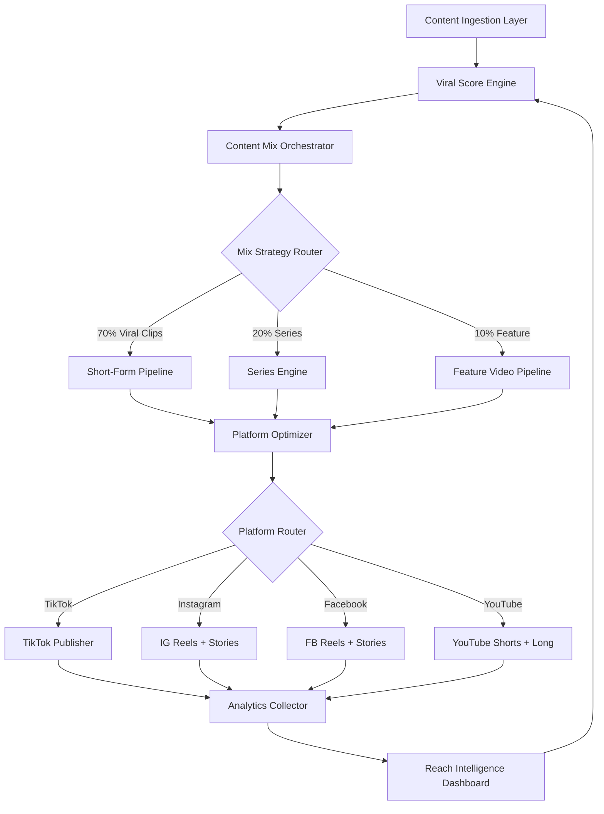
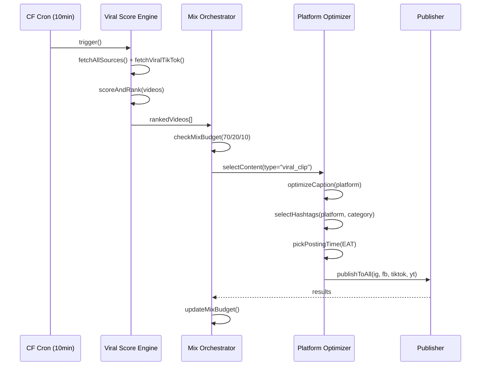
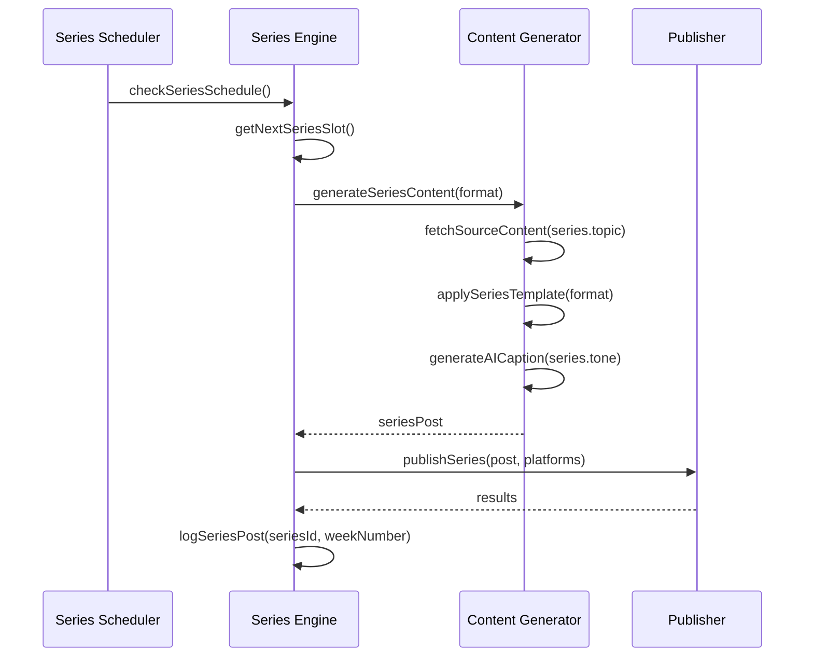

# Design Document: Entertainment Reach Engine

## Overview

The Entertainment Reach Engine is a comprehensive content strategy and automation system that maximizes PPP TV Kenya's reach and engagement across TikTok, Facebook, Instagram, and YouTube. It implements a 70/20/10 content mix (70% short viral clips, 20% recurring series, 10% feature videos), enforces platform-specific optimization, and introduces a Series Engine for recurring branded formats like "Street Question Friday" and "Best Dressed of the Week". The system builds on the existing automate, composer, factory, and viral-intelligence infrastructure already in the codebase.

The platform targets a Kenya-first audience with global readability — funny, stylish, fast, and culturally current — covering comedy skits, music/dance, fashion, sports banter, pop-culture commentary, street content, celebrity content, memes, and viral trends. Everything except sex/nudity is in scope.

## Architecture



## Sequence Diagrams

### Viral Clip Pipeline (70% flow)



### Series Engine Flow (20% flow)



## Components and Interfaces

### Component 1: Content Mix Orchestrator

**Purpose**: Enforces the 70/20/10 content strategy, tracks daily mix budget, and routes content to the correct pipeline.

**Interface**:

```typescript
interface ContentMixOrchestrator {
  getMixBudget(date: string): Promise<MixBudget>;
  selectPipeline(content: RankedContent): ContentPipeline;
  updateBudget(date: string, type: ContentType): Promise<void>;
  getDailyMixReport(date: string): Promise<MixReport>;
}

type ContentType = "viral_clip" | "series" | "feature_video";

interface MixBudget {
  date: string;
  viralClips: { used: number; target: number }; // 70%
  series: { used: number; target: number }; // 20%
  featureVideos: { used: number; target: number }; // 10%
  totalPosts: number;
}
```

**Responsibilities**:

- Track how many posts of each type have been published today
- Enforce the 70/20/10 ratio across a rolling 7-day window (not just per-day)
- Escalate to viral clips when series content is unavailable
- Expose mix health metrics to the dashboard

### Component 2: Series Engine

**Purpose**: Manages recurring branded content formats with weekly/daily schedules, templates, and automated content sourcing.

**Interface**:

```typescript
interface SeriesEngine {
  getActiveSeriesFormats(): SeriesFormat[];
  getNextDueFormat(now: Date): SeriesFormat | null;
  generateSeriesPost(format: SeriesFormat): Promise<SeriesPost>;
  logSeriesPost(formatId: string, post: SeriesPost): Promise<void>;
  getSeriesHistory(formatId: string, limit: number): Promise<SeriesPost[]>;
}

interface SeriesFormat {
  id: string;
  name: string; // e.g. "Street Question Friday"
  cadence: "daily" | "weekly";
  dayOfWeek?: number; // 0=Sun, 5=Fri for "Friday" series
  timeEAT: number; // hour in EAT to post
  contentType: "video" | "carousel" | "image";
  topic: string; // e.g. "street interviews kenya"
  tone: "funny" | "informative" | "hype" | "debate";
  hashtagSet: string[];
  platforms: Platform[];
  templatePrompt: string; // AI prompt template for this series
  coverStyle: "bold" | "minimal" | "meme";
  active: boolean;
}
```

### Component 3: Platform Optimizer

**Purpose**: Transforms a generic content item into platform-specific posts with optimal captions, hashtags, aspect ratios, and posting times per platform.

**Interface**:

```typescript
interface PlatformOptimizer {
  optimize(
    content: ContentItem,
    platforms: Platform[],
  ): Promise<PlatformPost[]>;
  getBestPostingTime(platform: Platform, category: string): number; // EAT hour
  buildCaption(content: ContentItem, platform: Platform): string;
  selectHashtags(category: string, platform: Platform): string[];
  getAspectRatio(platform: Platform, contentType: string): AspectRatio;
}

type Platform = "instagram" | "facebook" | "tiktok" | "youtube";
type AspectRatio = "9:16" | "1:1" | "16:9" | "4:5";

interface PlatformPost {
  platform: Platform;
  caption: string;
  hashtags: string[];
  firstComment?: string;
  aspectRatio: AspectRatio;
  scheduledAt: Date;
  contentType: "reel" | "story" | "feed" | "short" | "video";
}
```

### Component 4: Viral Score Engine (extends existing viral-intelligence.ts)

**Purpose**: Scores content across all entertainment categories with Kenya-first weighting, trend matching, and platform-specific virality signals.

**Interface**:

```typescript
interface ViralScoreEngine {
  scoreContent(item: RawContentItem): ViralScore;
  fetchTrendingTopics(platforms: Platform[]): Promise<TrendingTopic[]>;
  getKenyaBoost(item: RawContentItem): number;
  getCategoryHeat(category: EntertainmentCategory): number;
  rankBatch(items: RawContentItem[]): RankedContent[];
}

type EntertainmentCategory =
  | "COMEDY"
  | "MUSIC"
  | "DANCE"
  | "FASHION"
  | "SPORTS_BANTER"
  | "POP_CULTURE"
  | "STREET_CONTENT"
  | "CELEBRITY"
  | "MEMES"
  | "VIRAL_TRENDS"
  | "TV_FILM"
  | "INFLUENCERS"
  | "EAST_AFRICA";

interface ViralScore {
  total: number; // 0-100
  recency: number; // 0-100
  engagement: number; // 0-100
  kenyaRelevance: number; // 0-100, +25 boost for Kenyan content
  categoryHeat: number; // 0-100
  trendMatch: number; // 0-100, matches current trending topics
  platformFit: number; // 0-100, how well it fits target platforms
}
```

### Component 5: Reach Intelligence Dashboard

**Purpose**: Extends the existing intelligence page with reach-specific metrics — series performance, mix health, platform breakdown, and virality trends.

**Interface**:

```typescript
interface ReachIntelligence {
  getMixHealth(days: number): Promise<MixHealthReport>;
  getSeriesPerformance(formatId: string): Promise<SeriesPerformanceReport>;
  getPlatformReachBreakdown(days: number): Promise<PlatformReachReport>;
  getTopPerformingCategories(days: number): Promise<CategoryRankReport>;
  getViralityTrends(days: number): Promise<ViralityTrendReport>;
}

interface MixHealthReport {
  period: string;
  viralClipsPct: number; // actual % vs 70% target
  seriesPct: number; // actual % vs 20% target
  featureVideoPct: number; // actual % vs 10% target
  onTarget: boolean;
  recommendation: string;
}
```

## Data Models

### Model 1: SeriesFormat

```typescript
interface SeriesFormat {
  id: string; // e.g. "street-question-friday"
  name: string; // "Street Question Friday"
  emoji: string; // "🎤"
  description: string;
  cadence: "daily" | "weekly" | "biweekly";
  dayOfWeek?: number; // 5 = Friday
  timeEAT: number; // 18 = 6pm EAT
  contentType: "video" | "carousel" | "image";
  category: EntertainmentCategory;
  tone: "funny" | "informative" | "hype" | "debate" | "inspirational";
  platforms: Platform[];
  hashtagSet: string[];
  templatePrompt: string;
  coverStyle: "bold" | "minimal" | "meme" | "countdown";
  sourceKeywords: string[]; // keywords to find source content
  active: boolean;
  createdAt: string;
  lastPostedAt?: string;
  totalPosts: number;
}
```

**Validation Rules**:

- `id` must be kebab-case, unique
- `dayOfWeek` required when `cadence` is "weekly"
- `timeEAT` must be 0-23
- `platforms` must have at least one entry
- `sourceKeywords` must have at least one entry
- `templatePrompt` must be non-empty

### Model 2: ContentMixState

```typescript
interface ContentMixState {
  date: string; // YYYY-MM-DD
  posts: {
    viral_clip: number;
    series: number;
    feature_video: number;
  };
  targets: {
    viral_clip: number; // floor(dailyTarget * 0.70)
    series: number; // floor(dailyTarget * 0.20)
    feature_video: number; // floor(dailyTarget * 0.10)
  };
  dailyTarget: number; // configurable, default 10
  lastUpdated: string;
}
```

### Model 3: PlatformOptimizationConfig

```typescript
interface PlatformOptimizationConfig {
  platform: Platform;
  maxCaptionLength: number; // IG=2200, FB=63206, TT=2200, YT=5000
  maxHashtags: number; // IG=30, FB=10, TT=5, YT=15
  optimalHashtags: number; // IG=5-10, FB=3-5, TT=3-5, YT=5-8
  peakHoursEAT: number[]; // best posting hours in EAT
  preferredAspectRatio: AspectRatio;
  supportsFirstComment: boolean; // IG=true, FB=false, TT=false, YT=false
  reelMaxDurationSec: number; // IG=90, FB=60, TT=60, YT=60
  hashtagStyle: "caption" | "comment" | "mixed";
}
```

## Recurring Series Formats

The following series are the initial set. All are stored in Supabase `series_formats` table and manageable via a new Series Manager UI.

| ID                       | Name                        | Cadence | Day | Time EAT | Format         | Category       |
| ------------------------ | --------------------------- | ------- | --- | -------- | -------------- | -------------- |
| `street-question-friday` | Street Question Friday 🎤   | Weekly  | Fri | 18:00    | Video carousel | STREET_CONTENT |
| `best-dressed-week`      | Best Dressed of the Week 👗 | Weekly  | Sun | 12:00    | Carousel       | FASHION        |
| `top5-kenya-trends`      | Top 5 Kenyan Trends 🔥      | Weekly  | Mon | 08:00    | Carousel       | VIRAL_TRENDS   |
| `comedy-skit-wednesday`  | Comedy Skit Wednesday 😂    | Weekly  | Wed | 19:00    | Video          | COMEDY         |
| `music-drop-alert`       | New Music Drop Alert 🎵     | Daily   | —   | 10:00    | Video/Image    | MUSIC          |
| `sports-banter-monday`   | Sports Banter Monday ⚽     | Weekly  | Mon | 20:00    | Carousel       | SPORTS_BANTER  |
| `celeb-tea-thursday`     | Celeb Tea Thursday ☕       | Weekly  | Thu | 17:00    | Image          | CELEBRITY      |
| `meme-of-the-day`        | Meme of the Day 💀          | Daily   | —   | 13:00    | Image          | MEMES          |
| `east-africa-spotlight`  | East Africa Spotlight 🌍    | Weekly  | Sat | 11:00    | Carousel       | EAST_AFRICA    |
| `throwback-tuesday`      | Throwback Tuesday 📼        | Weekly  | Tue | 15:00    | Video/Image    | POP_CULTURE    |

## Algorithmic Pseudocode

### Main Algorithm: Content Mix Orchestrator

```pascal
ALGORITHM runContentMixCycle()
INPUT: none (triggered by CF cron every 10 minutes)
OUTPUT: PostResult

BEGIN
  now ← getCurrentTimeEAT()

  IF isDeadZone(now) THEN  // 1am-5am EAT
    RETURN { skipped: true, reason: "dead zone" }
  END IF

  lock ← acquireDistributedLock("mix-cycle")
  IF NOT lock.acquired THEN
    RETURN { skipped: true, reason: "concurrent run" }
  END IF

  TRY
    budget ← getMixBudget(today())

    // Determine which pipeline to use based on mix deficit
    pipeline ← selectPipeline(budget)

    IF pipeline = "series" THEN
      dueSeries ← getNextDueSeries(now)
      IF dueSeries IS NOT NULL THEN
        post ← generateSeriesPost(dueSeries)
        result ← publishPost(post, dueSeries.platforms)
        updateBudget(today(), "series")
        RETURN result
      END IF
      // No series due — fall through to viral clip
      pipeline ← "viral_clip"
    END IF

    IF pipeline = "feature_video" THEN
      feature ← selectFeatureVideo()
      IF feature IS NOT NULL THEN
        post ← buildFeaturePost(feature)
        result ← publishPost(post, ALL_PLATFORMS)
        updateBudget(today(), "feature_video")
        RETURN result
      END IF
      pipeline ← "viral_clip"
    END IF

    // Default: viral clip (70% path)
    videos ← fetchAndRankVideos()
    target ← selectBestVideo(videos)
    IF target IS NULL THEN
      RETURN { posted: 0, reason: "no viable content" }
    END IF

    optimized ← optimizeForPlatforms(target, [IG, FB, TIKTOK, YT])
    result ← publishAll(optimized)
    updateBudget(today(), "viral_clip")
    RETURN result

  FINALLY
    releaseLock(lock)
  END TRY
END
```

**Preconditions:**

- Distributed lock service is available
- Supabase connection is active
- At least one platform credential is configured

**Postconditions:**

- At most one post published per invocation
- Mix budget updated atomically
- Result logged to Supabase `post_log`

**Loop Invariants:** N/A (single-pass per cron tick)

### Algorithm: selectPipeline()

```pascal
ALGORITHM selectPipeline(budget: MixBudget)
INPUT: budget — current day's mix state
OUTPUT: pipeline of type ContentType

BEGIN
  total ← budget.posts.viral_clip + budget.posts.series + budget.posts.feature_video

  IF total = 0 THEN
    RETURN "viral_clip"  // always start with viral
  END IF

  actualViralPct   ← budget.posts.viral_clip / total
  actualSeriesPct  ← budget.posts.series / total
  actualFeaturePct ← budget.posts.feature_video / total

  // Find most under-represented type vs target
  viralDeficit   ← 0.70 - actualViralPct
  seriesDeficit  ← 0.20 - actualSeriesPct
  featureDeficit ← 0.10 - actualFeaturePct

  // Series takes priority when it's due (time-sensitive)
  dueSeries ← getNextDueSeries(now())
  IF dueSeries IS NOT NULL AND seriesDeficit >= -0.05 THEN
    RETURN "series"
  END IF

  // Feature video when significantly under-represented
  IF featureDeficit > 0.05 THEN
    RETURN "feature_video"
  END IF

  RETURN "viral_clip"
END
```

### Algorithm: Platform Caption Optimizer

```pascal
ALGORITHM buildPlatformCaption(content: ContentItem, platform: Platform)
INPUT: content — scored and selected content item
       platform — target social platform
OUTPUT: caption of type string

BEGIN
  config ← PLATFORM_CONFIGS[platform]
  base   ← content.aiCaption OR content.title

  // Platform-specific tone adjustments
  IF platform = "tiktok" THEN
    caption ← injectTikTokHooks(base)
    caption ← addTrendingSounds(caption, content.category)
    hashtags ← selectHashtags(content.category, platform, max=5)
    RETURN truncate(caption + "\n\n" + hashtags, config.maxCaptionLength)
  END IF

  IF platform = "instagram" THEN
    caption ← base
    // Hashtags go in first comment on IG — keeps caption clean
    RETURN truncate(caption, config.maxCaptionLength)
  END IF

  IF platform = "facebook" THEN
    caption ← base + "\n\n" + content.sourceUrl
    hashtags ← selectHashtags(content.category, platform, max=5)
    RETURN truncate(caption + "\n\n" + hashtags, config.maxCaptionLength)
  END IF

  IF platform = "youtube" THEN
    caption ← buildYouTubeDescription(content)
    hashtags ← selectHashtags(content.category, platform, max=8)
    RETURN caption + "\n\n" + hashtags
  END IF
END
```

**Preconditions:**

- `content.aiCaption` or `content.title` is non-empty
- `platform` is one of the four supported values
- `PLATFORM_CONFIGS` is fully initialized

**Postconditions:**

- Returned caption does not exceed `config.maxCaptionLength`
- Hashtag count does not exceed `config.maxHashtags`
- Caption contains at least one verifiable fact from content

### Algorithm: Series Content Generator

```pascal
ALGORITHM generateSeriesPost(format: SeriesFormat)
INPUT: format — the series format definition
OUTPUT: SeriesPost

BEGIN
  // Source relevant content for this series
  sourceItems ← fetchContentByKeywords(format.sourceKeywords, limit=10)
  sourceItems ← filterByRecency(sourceItems, hours=48)
  sourceItems ← rankByViralScore(sourceItems)

  IF sourceItems IS EMPTY THEN
    sourceItems ← fetchFallbackContent(format.category)
  END IF

  selected ← sourceItems[0]

  // Build series-specific AI prompt
  prompt ← interpolateTemplate(
    format.templatePrompt,
    { content: selected, seriesName: format.name, tone: format.tone }
  )

  aiContent ← generateAIContent(selected, { tone: format.tone })

  // Apply series branding
  caption ← buildSeriesCaption(
    format.name, format.emoji, aiContent.caption, format.tone
  )

  coverImage ← generateSeriesCover(
    selected, format.coverStyle, format.name, format.emoji
  )

  RETURN {
    formatId: format.id,
    seriesName: format.name,
    content: selected,
    caption: caption,
    coverImage: coverImage,
    hashtags: format.hashtagSet,
    platforms: format.platforms,
    scheduledAt: getNextSeriesTime(format)
  }
END
```

## Key Functions with Formal Specifications

### Function 1: getMixBudget()

```typescript
async function getMixBudget(date: string): Promise<MixBudget>;
```

**Preconditions:**

- `date` is a valid ISO date string (YYYY-MM-DD)
- Supabase client is initialized

**Postconditions:**

- Returns a `MixBudget` with `used + remaining = dailyTarget` for each type
- `targets.viral_clip = floor(dailyTarget * 0.70)`
- `targets.series = floor(dailyTarget * 0.20)`
- `targets.feature_video = floor(dailyTarget * 0.10)`
- Never throws — returns zero-state budget on DB error

### Function 2: scoreContent()

```typescript
function scoreContent(
  item: RawContentItem,
  trendingTopics: string[],
): ViralScore;
```

**Preconditions:**

- `item.publishedAt` is a valid Date
- `item.title` is non-empty string
- `item.category` is a valid EntertainmentCategory

**Postconditions:**

- All score fields are in range [0, 100]
- `total = weighted_avg(recency*0.35, engagement*0.30, kenyaRelevance*0.20, categoryHeat*0.10, trendMatch*0.05)`
- Kenyan content receives +25 boost to `kenyaRelevance` before weighting
- Content older than 48h receives `recency = 0`

**Loop Invariants:** N/A (pure function, no loops)

### Function 3: getNextDueSeries()

```typescript
function getNextDueSeries(now: Date): SeriesFormat | null;
```

**Preconditions:**

- `now` is a valid Date in any timezone (internally converted to EAT)
- Series formats are loaded from Supabase

**Postconditions:**

- Returns the highest-priority series format that is due within ±30 minutes of `now`
- Returns `null` if no series is due in that window
- Priority order: overdue series first, then by `timeEAT` proximity
- Only returns formats where `active = true`

### Function 4: optimizeForPlatforms()

```typescript
async function optimizeForPlatforms(
  content: RankedContent,
  platforms: Platform[],
): Promise<PlatformPost[]>;
```

**Preconditions:**

- `content.viralScore.total > 0`
- `platforms` is non-empty
- At least one platform credential is configured in env

**Postconditions:**

- Returns one `PlatformPost` per platform in input array
- Each post's `caption.length <= PLATFORM_CONFIGS[platform].maxCaptionLength`
- Each post's hashtag count `<= PLATFORM_CONFIGS[platform].maxHashtags`
- `scheduledAt` is set to the next optimal posting window in EAT for that platform

### Function 5: publishSeriesPost()

```typescript
async function publishSeriesPost(
  post: SeriesPost,
  platforms: Platform[],
): Promise<PublishResult>;
```

**Preconditions:**

- `post.caption` is non-empty
- `post.coverImage` is a valid Buffer or staged R2 URL
- `platforms` contains at least one configured platform

**Postconditions:**

- Attempts publish to all specified platforms in parallel
- Logs result to `post_log` with `post_type = "series"` and `series_format_id`
- Updates `series_formats.lastPostedAt` and increments `totalPosts`
- Returns partial success if at least one platform succeeds
- Never throws — wraps all errors in result object

## Platform-Specific Optimization Rules

### TikTok

- Caption max 2,200 chars; optimal 150-300 chars
- Max 5 hashtags in caption (algorithm penalizes hashtag stuffing)
- Hook in first 1-2 seconds is critical — caption should reference it
- Trending sounds boost reach 3-5x — system checks TikTok trending audio weekly
- Optimal post times EAT: 7am, 12pm, 6pm, 9pm
- Content categories that perform best: COMEDY, DANCE, MUSIC, STREET_CONTENT, MEMES

### Instagram Reels

- Caption max 2,200 chars; optimal 100-150 chars (rest hidden behind "more")
- Hashtags in first comment (not caption) — keeps caption clean, same reach
- Optimal 5-10 hashtags in first comment
- Cover image critical — branded PPP TV cover with Bebas Neue headline
- Optimal post times EAT: 8am, 12pm, 6pm, 8pm
- Reels get 3-5x more reach than feed posts — always prefer Reels format

### Facebook Reels + Feed

- Caption can be longer — Facebook rewards context and storytelling
- 3-5 hashtags in caption (not first comment — FB doesn't support that)
- Source URL in caption drives link clicks
- Optimal post times EAT: 9am, 1pm, 7pm
- Video posts get 2x organic reach vs image posts on FB pages

### YouTube Shorts + Long-form

- Shorts: vertical 9:16, max 60 seconds, title max 100 chars
- Long-form: horizontal 16:9, title max 100 chars, description up to 5,000 chars
- Tags (not hashtags) in description — 5-8 relevant tags
- Thumbnail is critical for long-form — branded PPP TV style
- Optimal upload times EAT: 8am, 2pm (Shorts); 6pm (Long-form)
- First 24-48h velocity determines long-term ranking

## Example Usage

### Example 1: Triggering a Series Post Manually

```typescript
// POST /api/series/trigger
const response = await fetch("/api/series/trigger", {
  method: "POST",
  headers: { "Content-Type": "application/json" },
  body: JSON.stringify({
    formatId: "street-question-friday",
    platforms: ["instagram", "facebook"],
  }),
});
// Returns: { posted: 1, series: "Street Question Friday", platforms: [...] }
```

### Example 2: Checking Mix Health

```typescript
// GET /api/mix-health?days=7
const report = await fetch("/api/mix-health?days=7");
// Returns:
// {
//   viralClipsPct: 68,   // target: 70 — slightly under
//   seriesPct: 22,       // target: 20 — slightly over
//   featureVideoPct: 10, // target: 10 — on target
//   onTarget: true,
//   recommendation: "Increase viral clips by 2% this week"
// }
```

### Example 3: Platform-Optimized Caption for Comedy Skit

```typescript
const content = {
  title: "Eric Omondi's new skit has Nairobi laughing",
  category: "COMEDY",
  aiCaption: "Eric Omondi drops another banger...",
  sourceUrl: "https://tiktok.com/@ericomondi/video/123",
};

// Instagram output (short, hashtags in comment)
// Caption: "Eric Omondi drops another banger 😂\n\nTag someone who needs this!"
// First comment: "#KenyaComedy #PPPTVKenya #EricOmondi #Funny #Viral"

// TikTok output (hook-first, hashtags in caption)
// Caption: "POV: Nairobi on a Friday 😂 #KenyaComedy #PPPTVKenya #Funny"

// Facebook output (longer, with source)
// Caption: "Eric Omondi drops another banger...\n\nSource: TikTok\n#KenyaComedy #PPPTVKenya #Funny"
```

## Error Handling

### Error Scenario 1: Series Content Source Unavailable

**Condition**: `fetchContentByKeywords()` returns empty for a due series format
**Response**: Fall back to `fetchFallbackContent(format.category)` using broader category search
**Recovery**: If fallback also empty, skip this series slot and log `series_skip` event; cron will retry next cycle

### Error Scenario 2: Platform Credential Expired

**Condition**: Meta Graph API returns 190 (token expired) or 102 (session invalidated)
**Response**: Immediately halt publishing to that platform; alert via existing `alertRateLimit()` mechanism
**Recovery**: Log to `system_alerts` table; dashboard shows red platform health pill; other platforms continue unaffected

### Error Scenario 3: Mix Budget Corruption

**Condition**: Supabase `mix_budget` row returns inconsistent counts (e.g. negative values)
**Response**: Reset to zero-state for the day and log a `budget_reset` event
**Recovery**: Continue with viral clip pipeline (safest default); send alert to dashboard

### Error Scenario 4: Series Format Misconfiguration

**Condition**: `SeriesFormat.templatePrompt` is empty or `sourceKeywords` is empty
**Response**: Skip format, log validation error with format ID
**Recovery**: Mark format `active = false` until manually corrected via Series Manager UI

### Error Scenario 5: TikTok Publisher Rate Limit

**Condition**: TikTok API returns 429 or daily post quota exceeded
**Response**: Skip TikTok for current cycle; publish to IG/FB/YT only
**Recovery**: Resume TikTok next cycle; log skip count to analytics

## Testing Strategy

### Unit Testing Approach

Key units to test in isolation:

- `selectPipeline()` — verify correct pipeline selected for all budget states
- `scoreContent()` — verify score bounds, Kenya boost, recency decay
- `getNextDueSeries()` — verify correct series returned for each day/hour combo
- `buildPlatformCaption()` — verify length limits and hashtag placement per platform
- `getMixBudget()` — verify target calculations at various `dailyTarget` values

### Property-Based Testing Approach

**Property Test Library**: fast-check

Properties to verify:

- For any `MixBudget`, `selectPipeline()` always returns a valid `ContentType`
- For any `ContentItem`, `scoreContent()` always returns scores in [0, 100]
- For any `platform` and `ContentItem`, caption length never exceeds `PLATFORM_CONFIGS[platform].maxCaptionLength`
- For any `dailyTarget > 0`, mix targets always sum to `<= dailyTarget`
- For any valid `SeriesFormat`, `getNextSeriesTime()` always returns a future Date

### Integration Testing Approach

- End-to-end series post: trigger → generate → publish → log → verify Supabase record
- Mix orchestrator full cycle: budget check → pipeline select → publish → budget update
- Platform optimizer: raw content in → platform posts out, verify all platform constraints satisfied
- Competitor monitor integration: new competitor post detected → "Cover This" flow → composer pre-filled

## Performance Considerations

- Series content generation adds ~2-3s latency vs standard viral clip flow (extra AI prompt for series template)
- Platform optimizer runs caption generation for up to 4 platforms in parallel using `Promise.all()`
- Mix budget reads/writes use Supabase upsert with row-level locking to prevent race conditions under concurrent cron runs
- Series format list is cached in-memory for 5 minutes to avoid repeated Supabase reads per cron tick
- Viral score ranking runs on up to 100 candidates; capped to prevent timeout on Vercel's 300s limit

## Security Considerations

- Series Manager UI requires existing auth middleware (same as composer/factory pages)
- Series `templatePrompt` is sanitized before passing to Gemini to prevent prompt injection
- Platform credentials remain in env vars only — never stored in Supabase or exposed to client
- Mix budget endpoint (`/api/mix-health`) is protected by `AUTOMATE_SECRET` bearer token
- All new API routes follow existing auth pattern: validate `Authorization: Bearer <secret>` header

## Dependencies

**Existing (reused)**:

- `src/lib/viral-intelligence.ts` — `calculateViralScore`, `fetchViralTikTokVideos`, `PEAK_TIMES`
- `src/lib/gemini.ts` — `generateAIContent`, `verifyStory`
- `src/lib/publisher.ts` — `publish`, `publishVideo`, `publishStories`
- `src/lib/supabase.ts` — `logPost`, `isArticleSeen`, `markArticleSeen`, `getBlacklist`
- `src/lib/image-gen.ts` — `generateImage` (extended for series cover styles)
- Cloudflare Worker — distributed lock, R2 staging, daily count KV

**New**:

- Supabase tables: `series_formats`, `mix_budget`, `series_post_log`
- `src/lib/series-engine.ts` — series scheduling and content generation
- `src/lib/platform-optimizer.ts` — per-platform caption/hashtag/timing optimization
- `src/lib/content-mix.ts` — 70/20/10 budget tracking and pipeline selection
- `src/app/api/series/trigger/route.ts` — manual series trigger endpoint
- `src/app/api/mix-health/route.ts` — mix health report endpoint
- `src/app/series/page.tsx` — Series Manager UI (create/edit/pause series formats)
- Extended `src/app/intelligence/page.tsx` — add mix health and series performance panels
