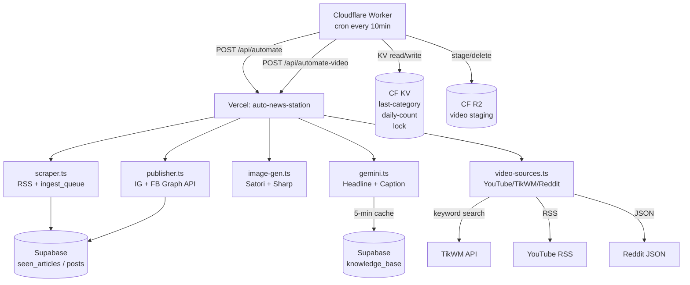
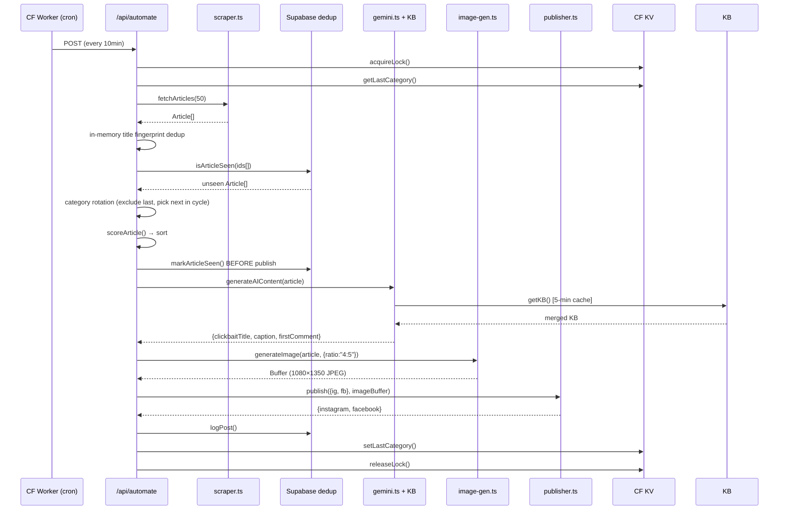
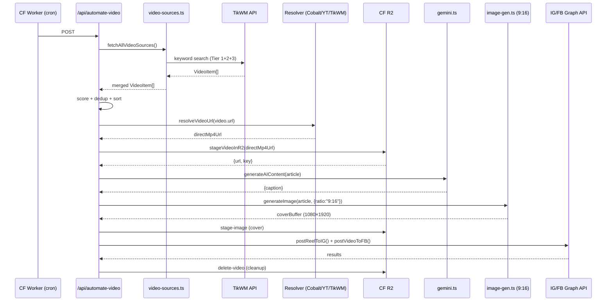

# Design Document: PPP TV Kenya Station Overhaul

## Overview

PPP TV Kenya is a Next.js 14 autonomous social media station deployed on Vercel (`auto-news-station`) that posts entertainment, sports, music, and celebrity content to Instagram and Facebook 24/7. A Cloudflare Worker handles cron scheduling, KV state, and R2 video staging.

This overhaul fixes six critical production failures and raises overall content quality:

1. Wrong Vercel deployment target (`auto-news-station-1` instead of `auto-news-station`)
2. Silent Gemini errors due to incorrect API call structure
3. Broken category rotation (no KV persistence, no hard-exclude logic)
4. Broken deduplication (anon key used for writes, mark-after-post race condition)
5. Knowledge Base loaded at startup only, not injected into every prompt
6. Thumbnail dimensions wrong, branding inconsistent

Plus three quality improvements: headline/caption voice, video keyword scraping, and RSS parser hardening.

### Key Technologies

- **Next.js 14** (App Router, Edge-compatible route handlers)
- **Google Gemini 2.0 Flash** via `@google/genai` SDK
- **Satori + Sharp** for server-side image generation
- **Supabase** (PostgreSQL) for post logs, dedup, KB, agent state
- **Cloudflare Worker** with KV (state) and R2 (video staging)
- **TikWM API** for TikTok video fetching by account and keyword

---

## Architecture

### High-Level System Diagram



### Request Flow — Image Post Pipeline



### Request Flow — Video Post Pipeline



---

## Components and Interfaces

### 1. Vercel Project Config (`/.vercel/project.json`)

**Current (broken):** `"projectName": "auto-news-station-1"`
**Fixed:** `"projectName": "auto-news-station"`

No code change — single JSON field update. All deployments after this fix target the correct project.

---

### 2. Gemini Client (`src/lib/gemini.ts`)

#### Key function signatures (unchanged externally, fixed internally)

```typescript
// Internal — fixed to use config.systemInstruction correctly
async function generateHeadline(
  article: Article,
  client: GoogleGenAI,
  kb: Record<string, string>
): Promise<string>

async function generateCaption(
  article: Article,
  client: GoogleGenAI,
  kb: Record<string, string>
): Promise<string>

// Public exports — unchanged
export async function generateAIContent(
  article: Article,
  options?: { isVideo?: boolean }
): Promise<AIContent>

export async function buildExcerptCaption(
  article: Article
): Promise<{ headline: string; caption: string }>
```

#### Gemini call structure (fixed)

```typescript
// BEFORE (broken — systemInstruction ignored):
const response = await client.models.generateContent({
  model: "gemini-2.0-flash",
  contents: [
    { role: "user", parts: [{ text: systemPrompt + "\n\n" + prompt }] }
  ],
});

// AFTER (correct):
const response = await client.models.generateContent({
  model: "gemini-2.0-flash",
  contents: [{ role: "user", parts: [{ text: prompt }] }],
  config: {
    systemInstruction: systemPrompt,
    temperature: 0.65,
    maxOutputTokens: 80,   // headline
  },
});
```

#### Retry + validation logic

```typescript
async function generateWithRetry(
  fn: () => Promise<string>,
  validate: (s: string) => boolean,
  fallback: string,
  maxRetries = 2
): Promise<string>
```

- Headline validation: `s.length >= 6 && s.length <= 100`
- Caption validation: `s.length >= 50`
- On all retries exhausted: return structured fallback, log `"[gemini] AI fallback used: <reason>"`

#### Headline post-processing

```typescript
function enforceHeadlineRules(headline: string): string {
  // 1. Uppercase
  // 2. Strip banned words
  // 3. Count words — if > 7, truncate to first 7
  // 4. Strip disallowed punctuation
}

const BANNED_WORDS = [
  "SHOCKING", "AMAZING", "INCREDIBLE",
  "YOU WON'T BELIEVE", "MUST SEE", "EXPLOSIVE", "BOMBSHELL"
];
```

---

### 3. KB Loader (`src/lib/gemini.ts` — `getKB()`)

```typescript
// Cache state (module-level)
let _kbCache: Record<string, string> = {};
let _kbLoadTime = 0;
const KB_CACHE_TTL = 5 * 60 * 1000; // 5 minutes

async function getKB(): Promise<Record<string, string>>
// Returns: { ...KB_DEFAULTS, ...supabaseRows }
// Supabase values override defaults key-by-key
// On Supabase error: returns KB_DEFAULTS, logs warning

// Cache invalidation — called by KB API route on POST/DELETE
export function invalidateKBCache(): void {
  _kbLoadTime = 0;
}
```

The KB API route (`/api/knowledge-base/route.ts`) calls `invalidateKBCache()` after every successful save or delete, so the next AI call always picks up the latest content.

---

### 4. Category Rotation (`src/app/api/automate/route.ts`)

```typescript
const CATEGORY_CYCLE = [
  "ENTERTAINMENT", "SPORTS", "MUSIC", "CELEBRITY",
  "TV & FILM", "MOVIES", "LIFESTYLE", "GENERAL",
];

async function getLastCategory(): Promise<string>   // GET /last-category from CF KV
async function setLastCategory(cat: string): Promise<void> // POST /last-category to CF KV

function selectNextCategory(
  lastCategory: string,
  availableCategories: string[]
): string | null
// Returns the next category in CATEGORY_CYCLE after lastCategory
// that exists in availableCategories.
// If lastCategory is empty/unknown: returns null (no filter applied).
// If no other category available: returns null (post from any category).
```

**Selection logic:**
1. Hard-exclude articles in `lastCategory` (if alternatives exist)
2. Among remaining, find next category in `CATEGORY_CYCLE` after `lastCategory`
3. Filter candidates to that target category
4. Score and sort within candidates
5. After successful post: `setLastCategory(article.category)`

---

### 5. Deduplication (`src/lib/supabase.ts`)

```typescript
// Uses SUPABASE_SERVICE_KEY — bypasses RLS
export const supabaseAdmin = createClient(
  SUPABASE_URL,
  process.env.SUPABASE_SERVICE_KEY!,  // must be service key, not anon
  { auth: { persistSession: false } }
);

export async function isArticleSeen(id: string): Promise<boolean>
// Checks: seen_articles.id OR seen_articles title fingerprint (first 60 chars)
// Falls back to KV /seen/check if Supabase unavailable

export async function markArticleSeen(id: string, title?: string): Promise<void>
// Upserts to seen_articles with 30-day TTL logic
// Called BEFORE publish — not after

export async function isArticleSeenByTitle(titleFp: string): Promise<boolean>
// Checks seen_articles by title fingerprint column
```

**Startup warning** (in `src/app/api/automate/route.ts`):
```typescript
if (!process.env.SUPABASE_SERVICE_KEY) {
  console.warn("[dedup] SUPABASE_SERVICE_KEY not set — falling back to KV dedup");
}
```

**In-memory batch dedup** (before Supabase check):
```typescript
function deduplicateByTitleFingerprint(articles: Article[]): Article[] {
  const seen = new Set<string>();
  return articles.filter(a => {
    const fp = a.title.toLowerCase().replace(/[^a-z0-9]/g, "").slice(0, 60);
    if (seen.has(fp)) return false;
    seen.add(fp);
    return true;
  });
}
```

---

### 6. Image Generator (`src/lib/image-gen.ts`)

```typescript
export const IMAGE_RATIOS = {
  "4:5":  { w: 1080, h: 1350 },  // feed posts (default)
  "9:16": { w: 1080, h: 1920 },  // reels / stories
  "1:1":  { w: 1080, h: 1080 },
  "16:9": { w: 1920, h: 1080 },
};

export async function generateImage(
  article: Article,
  opts: { isBreaking?: boolean; ratio?: string } = {}
): Promise<Buffer>
// Default ratio: "4:5" (1080×1350)
// Video pipeline passes ratio: "9:16" (1080×1920)
```

**Layout layers (bottom to top):**
1. Full-bleed background image (resized to exact dimensions via Sharp `fit: "cover"`)
2. Fallback: solid `#111` div if image fetch fails
3. Gradient overlay: `rgba(0,0,0,0) 0% → rgba(0,0,0,1) 78%`
4. Top bar: `PPP TV KENYA` in `#E50914`, `24/7 GEN Z ENTERTAINMENT` subtitle
5. Logo: `PPP_LOGO_B64` at `top: 96, left: 40`, `240×96px`
6. Bottom area: category pill + headline + follow CTA + source credit

**Font sizing:**
```typescript
function getHeadlineFontSize(title: string): number
// chars ≤ 20 → 160px
// chars ≤ 30 → 140px  ...  chars > 110 → 58px
// Range: [58, 160]
```

---

### 7. Video Scraper (`src/lib/video-sources.ts`)

#### TikWM keyword search (new)

```typescript
interface TikWMSearchResult {
  id: string;
  title: string;
  play_url: string;
  cover: string;
  play_count: number;
  create_time: number;
  author: { unique_id: string; nickname: string };
}

async function searchTikWMByKeyword(
  keyword: string,
  count = 10,
  sortBy: "play_count" | "latest" = "play_count"
): Promise<VideoItem[]>
// POST https://www.tikwm.com/api/feed/search
// params: { keywords: keyword, count, sort_type: sortBy === "play_count" ? 1 : 0 }
// On zero results: returns [], does NOT throw
```

#### Tiered keyword list

```typescript
const VIDEO_KEYWORDS = {
  tier1: [  // Always searched — Kenya/Africa
    "Kenya entertainment viral", "Nairobi celebrity news",
    "Khaligraph Jones", "Sauti Sol", "Diamond Platnumz",
    "Eliud Kipchoge", "Harambee Stars", "SPM Buzz Kenya",
    "Kenya music 2025", "East Africa viral video",
  ],
  tier2: [  // Rotated — global sports/music
    "Premier League goals", "Champions League highlights",
    "Burna Boy", "Wizkid", "Davido", "Rema Afrobeats",
    "NBA highlights", "LeBron James", "viral celebrity 2025",
  ],
  tier3: [  // Occasional — background variety
    "viral video today", "trending worldwide",
    "celebrity gossip", "music video 2025",
  ],
};
```

#### Video scoring

```typescript
function scoreVideo(video: VideoItem & { _playCount?: number; _upvoteBoost?: number }): number {
  const { viralScore, recencyScore } = calculateViralScore(video);
  const kenyanBoost = isKenyanContent(video) ? 25 : 0;
  const playBoost = video._playCount >= 1_000_000 ? 40
                  : video._playCount >= 200_000  ? 20 : 0;
  const upvoteBoost = video._upvoteBoost ?? 0;
  return viralScore + recencyScore + kenyanBoost + playBoost + upvoteBoost;
}
```

---

### 8. Autonomous Operation (`cloudflare/worker.js` + `/api/automate/route.ts`)

#### Dead zone enforcement (in worker cron handler)

```javascript
function isDeadZone(nowEAT) {
  const h = nowEAT.getUTCHours(); // EAT = UTC+3
  const m = nowEAT.getUTCMinutes();
  // Dead zone: 1:00am–5:45am EAT = 22:00–02:45 UTC
  return (h === 22) || (h === 23) || (h === 0) ||
         (h === 1) || (h === 2 && m < 45);
}
```

#### Minimum gap enforcement

```javascript
async function canPost(env) {
  const lastPostTs = await env.SEEN_ARTICLES.get("last-post-ts");
  if (!lastPostTs) return true;
  return Date.now() - Number(lastPostTs) >= 10 * 60 * 1000; // 10 min
}
```

#### Daily cap (48/day)

```javascript
async function getDailyCount(env, date) { /* KV get daily:{date} */ }
// Pipeline checks: if count >= 48, log "Daily cap reached", return early
```

#### Structured logging format

```javascript
// Every pipeline event logs:
console.log(JSON.stringify({
  ts: new Date().toISOString(),
  step: "scrape|dedup|ai|image|publish|category",
  articleId: "...",
  status: "ok|skip|error|fallback",
  reason: "...",   // required on skip/error
  category: "...",
}));
```

---

### 9. Knowledge Base Page (`src/app/knowledge-base/page.tsx`)

#### New additions to existing UI

```typescript
// Test result now includes word/char count
interface TestResult {
  headline?: string;
  caption?: string;
  wordCount?: number;   // NEW
  charCount?: number;   // NEW
  usingLiveKB?: boolean; // NEW — from /api/preview-url response
}

// KB status indicator
// "Using live KB" (green) when Supabase data loaded
// "Using defaults" (orange) when falling back to KB_DEFAULTS
```

The `/api/preview-url` response is extended to include `{ usingLiveKB: boolean }` so the page can show the correct status.

On save (`handleSave`): calls `POST /api/knowledge-base` then immediately calls `POST /api/knowledge-base/invalidate-cache` (or the KB route calls `invalidateKBCache()` directly).

---

### 10. RSS Parser (`src/lib/scraper.ts` + `cloudflare/worker.js`)

```typescript
// Shared parsing utilities
function unwrapCDATA(raw: string): string {
  return raw.replace(/<!\[CDATA\[([\s\S]*?)\]\]>/g, "$1").trim();
}

function decodeEntities(str: string): string {
  return str
    .replace(/&amp;/g, "&").replace(/&lt;/g, "<")
    .replace(/&gt;/g, ">").replace(/&quot;/g, '"')
    .replace(/&#39;/g, "'").replace(/&apos;/g, "'");
}

function parseRSSItem(itemXml: string): Partial<Article> | null {
  // Extracts: title (CDATA-aware), link, pubDate, description, media:thumbnail
  // Returns null if title or link missing
}

// Timeout: AbortSignal.timeout(10_000) on all feed fetches
// Age filter: items older than 24h are dropped
function isWithin24h(pubDate: string | Date | undefined): boolean
```

---

## Data Models

### Article (existing, unchanged)

```typescript
interface Article {
  id: string;           // SHA-256(url).slice(0,16)
  title: string;
  url: string;
  imageUrl: string;
  summary: string;
  fullBody?: string;
  sourceName: string;
  category: string;     // uppercase: "ENTERTAINMENT", "SPORTS", etc.
  publishedAt: Date;
  videoUrl?: string;
  isVideo?: boolean;
  isBreaking?: boolean;
}
```

### VideoItem (existing, unchanged)

```typescript
interface VideoItem {
  id: string;
  title: string;
  url: string;
  directVideoUrl?: string;
  thumbnail: string;
  publishedAt: Date;
  sourceName: string;
  sourceType: "youtube" | "dailymotion" | "reddit" | "rss-video" | "vimeo" | "direct-mp4" | "twitter";
  category: string;
  duration?: number;
  _playCount?: number;    // from TikWM search
  _upvoteBoost?: number;  // from Reddit scoring
}
```

### AIContent (existing, unchanged)

```typescript
interface AIContent {
  clickbaitTitle: string;   // 4-7 word ALL CAPS headline
  caption: string;          // <180 words, Gen Z voice
  firstComment?: string;    // hashtags
  engagementType?: "debate" | "tag" | "save" | "share" | "poll";
}
```

### Supabase Tables

```sql
-- seen_articles: dedup store (30-day retention)
CREATE TABLE seen_articles (
  id        TEXT PRIMARY KEY,
  title     TEXT,
  title_fp  TEXT,          -- first 60 chars, normalised
  seen_at   TIMESTAMPTZ NOT NULL DEFAULT NOW()
);
CREATE INDEX ON seen_articles (title_fp);
CREATE INDEX ON seen_articles (seen_at);

-- knowledge_base: editable AI brain
CREATE TABLE knowledge_base (
  id         TEXT PRIMARY KEY,
  title      TEXT NOT NULL DEFAULT '',
  content    TEXT NOT NULL DEFAULT '',
  updated_at TIMESTAMPTZ NOT NULL DEFAULT NOW()
);

-- agent_state: KV-style persistent state
CREATE TABLE agent_state (
  key        TEXT PRIMARY KEY,
  value      TEXT NOT NULL,
  updated_at TIMESTAMPTZ NOT NULL DEFAULT NOW()
);

-- posts: post log + analytics
CREATE TABLE posts (
  id          UUID PRIMARY KEY DEFAULT gen_random_uuid(),
  article_id  TEXT UNIQUE,
  title       TEXT,
  url         TEXT,
  category    TEXT,
  source_name TEXT,
  post_type   TEXT,         -- "image" | "video" | "carousel"
  ig_success  BOOLEAN,
  ig_post_id  TEXT,
  ig_error    TEXT,
  fb_success  BOOLEAN,
  fb_post_id  TEXT,
  fb_error    TEXT,
  blocked     BOOLEAN DEFAULT FALSE,
  posted_at   TIMESTAMPTZ NOT NULL DEFAULT NOW()
);
```

### Cloudflare KV Keys

| Key | Value | TTL |
|-----|-------|-----|
| `last-category` | Category string e.g. `"SPORTS"` | 24h |
| `daily:{YYYY-MM-DD}` | Post count integer string | 48h |
| `pipeline:lock` | Unix timestamp string | 270s |
| `last-post-ts` | Unix timestamp string | 24h |
| `agent:enabled` | `"1"` or `"0"` | 365d |
| `seen:{id}` | `"1"` (KV fallback dedup) | 30d |
| `title:{fp}` | `"1"` (KV fallback title dedup) | 30d |

---

## Correctness Properties

*A property is a characteristic or behavior that should hold true across all valid executions of a system — essentially, a formal statement about what the system should do. Properties serve as the bridge between human-readable specifications and machine-verifiable correctness guarantees.*

### Property 1: Gemini calls always use correct model and systemInstruction

*For any* article passed to `generateHeadline` or `generateCaption`, the call to `client.models.generateContent` must use model `"gemini-2.0-flash"` and must have a non-empty `config.systemInstruction` field populated from the KB — never an empty string and never passed as a user-role message.

**Validates: Requirements 2.1, 2.2, 2.3**

---

### Property 2: AI output validation rejects out-of-range values and retries

*For any* Gemini response that returns a headline shorter than 6 characters or longer than 100 characters, or a caption shorter than 50 characters, the system must retry once and must never return the invalid value as the final output. If both attempts fail validation, a structured fallback is returned.

**Validates: Requirements 2.4, 2.5, 2.6**

---

### Property 3: Category rotation hard-excludes the last-posted category

*For any* list of articles containing at least one article in a category different from `lastCategory`, the article selected for posting must not be in `lastCategory`. The selection must follow the `CATEGORY_CYCLE` order for the next available category.

**Validates: Requirements 3.2, 3.3**

---

### Property 4: Last-category KV round-trip

*For any* successful post, writing the posted article's category to KV and then immediately reading it back must return the same category string.

**Validates: Requirements 3.1, 3.6**

---

### Property 5: Dedup marks articles seen before publish

*For any* article selected for posting, `markArticleSeen(id)` must be called and awaited before the publish call is made. If the publish call is never reached (e.g. image generation fails), the article remains marked seen.

**Validates: Requirements 4.3**

---

### Property 6: Dual-key dedup catches both URL variants and title variants

*For any* two articles where either the `id` (URL hash) matches OR the title fingerprint (first 60 normalised characters) matches a seen record, both articles must be filtered out by `isArticleSeen`. An article with a different URL but identical title fingerprint to a seen article must be treated as seen.

**Validates: Requirements 4.4**

---

### Property 7: In-memory batch dedup eliminates title duplicates

*For any* batch of articles containing two or more items with identical title fingerprints, `deduplicateByTitleFingerprint` must return a list where each title fingerprint appears exactly once.

**Validates: Requirements 4.6**

---

### Property 8: KB merge — Supabase values override defaults

*For any* KB key present in both `KB_DEFAULTS` and the Supabase `knowledge_base` table, `getKB()` must return the Supabase value. For any key present only in `KB_DEFAULTS`, `getKB()` must return the default value. The merged result must contain all keys from `KB_DEFAULTS`.

**Validates: Requirements 5.1, 5.5**

---

### Property 9: KB cache respects 5-minute TTL

*For any* two calls to `getKB()` within 5 minutes of each other, the second call must return the same cached object without making a Supabase network request. For any call made more than 5 minutes after the last load, a fresh Supabase fetch must be triggered.

**Validates: Requirements 5.2, 5.3**

---

### Property 10: Thumbnail font size stays within [58, 160] px

*For any* headline string of any length, `getHeadlineFontSize(headline)` must return a value in the inclusive range [58, 160].

**Validates: Requirements 6.6**

---

### Property 11: Category color lookup always returns a valid color

*For any* category string (including unknown categories), `getCatColor(category)` must return an object with non-empty `bg` and `text` hex color strings. Unknown categories must fall back to the GENERAL color `{ bg: "#E50914", text: "#FFFFFF" }`.

**Validates: Requirements 6.5**

---

### Property 12: Headlines are ALL CAPS and contain no banned words

*For any* headline produced by `enforceHeadlineRules`, the result must be entirely uppercase and must not contain any of the banned words: SHOCKING, AMAZING, INCREDIBLE, YOU WON'T BELIEVE, MUST SEE, EXPLOSIVE, BOMBSHELL.

**Validates: Requirements 7.4, 7.6**

---

### Property 13: Headlines are truncated to 7 words maximum

*For any* headline string with more than 7 words, `enforceHeadlineRules` must return a string containing exactly 7 words.

**Validates: Requirements 7.1, 7.5**

---

### Property 14: Captions are under 180 words

*For any* caption produced by `generateCaption`, the word count of the returned string must be less than 180.

**Validates: Requirements 8.1, 8.8**

---

### Property 15: Captions contain no hashtags and no banned phrases

*For any* caption produced by `generateCaption`, the string must contain no `#` characters and must not contain the substrings "stay tuned", "watch this space", or "find out why below" (case-insensitive).

**Validates: Requirements 8.4, 8.5**

---

### Property 16: Captions end with a source credit line

*For any* caption produced by `generateCaption` given an article with a non-empty `sourceName`, the last non-empty line of the caption must match the pattern `Source: <sourceName>`.

**Validates: Requirements 8.6**

---

### Property 17: Video scoring is additive and deterministic

*For any* video with known `publishedAt`, `title`, `category`, `_playCount`, and `_upvoteBoost`, calling `scoreVideo` twice must return the same integer, and the result must equal the sum of `viralScore + recencyScore + kenyanBoost + playBoost + upvoteBoost`.

**Validates: Requirements 9.4**

---

### Property 18: Video batch dedup eliminates URL and title duplicates

*For any* batch of `VideoItem` objects containing duplicates by URL or title fingerprint, the dedup pass must produce a list where each URL and each title fingerprint appears exactly once.

**Validates: Requirements 9.5**

---

### Property 19: Dead zone blocks all posts between 1:00am and 5:45am EAT

*For any* timestamp in the range 01:00–05:44 EAT, `isDeadZone(ts)` must return `true` and the pipeline must return early without calling any publish function.

**Validates: Requirements 10.6**

---

### Property 20: Minimum 10-minute gap between consecutive posts

*For any* two consecutive post timestamps `t1` and `t2`, `t2 - t1 >= 600_000` ms must hold. If `canPost()` returns false, the pipeline must skip without posting.

**Validates: Requirements 10.7**

---

### Property 21: Daily post cap never exceeds 48

*For any* day, the total number of successful posts recorded in KV `daily:{date}` must never exceed 48. Once the count reaches 48, all subsequent pipeline runs that day must return early with a "Daily cap reached" log.

**Validates: Requirements 10.8**

---

### Property 22: KB cache invalidated on save

*For any* save operation on the KB page, the in-memory `_kbLoadTime` must be reset to 0, so the next call to `getKB()` triggers a fresh Supabase fetch regardless of when the last fetch occurred.

**Validates: Requirements 11.5**

---

### Property 23: Caption word and character count match actual content

*For any* caption string displayed in the KB test result, the displayed `wordCount` must equal the number of whitespace-separated tokens in the caption, and `charCount` must equal `caption.length`.

**Validates: Requirements 11.6**

---

### Property 24: RSS parser round-trip

*For any* valid RSS `<item>` XML string, parsing it to an `Article` object, serialising the article back to an equivalent RSS item XML, and parsing again must produce an `Article` object with identical `title`, `url`, `publishedAt`, and `summary` fields.

**Validates: Requirements 12.1, 12.4**

---

### Property 25: RSS text extraction — CDATA unwrap and entity decode

*For any* RSS item title or description field that contains CDATA wrappers or HTML entities, the extracted text must equal the plain-text content with all CDATA markers removed and all HTML entities decoded to their Unicode equivalents.

**Validates: Requirements 12.2, 12.3**

---

### Property 26: RSS age filter excludes items older than 24 hours

*For any* RSS item with a `pubDate` more than 24 hours before the current time, `isWithin24h(pubDate)` must return `false` and the item must be excluded from the parsed output.

**Validates: Requirements 12.6**

---

## Error Handling

### Gemini Failures

| Failure | Handling |
|---------|----------|
| API error (4xx/5xx) | Log `[gemini] headline failed: <message>`, retry once, then use structured fallback |
| Empty response | Treated same as API error |
| Headline fails validation (< 6 or > 100 chars) | Retry once; if still invalid, use `rawTitle.toUpperCase().slice(0, 80)` |
| Caption fails validation (< 50 chars) | Retry once; if still invalid, use `"${body.slice(0,400)}\n\nFollow @ppptvke 🔥\n\nSource: ${source}"` |
| Caption exceeds 180 words | Retry with explicit word-count constraint; if still over, truncate at last sentence before word 180 |

All fallbacks log `[gemini] AI fallback used: <reason>` — never silent.

### Image Generation Failures

| Failure | Handling |
|---------|----------|
| Background image fetch fails | Use solid `#111` background, continue rendering |
| Font fetch fails | Try fallback fonts (Oswald → Inter); if all fail, throw — post is skipped |
| Satori render error | Log `[image-gen] render failed: <message>`, return error — pipeline skips post |
| Sharp processing error | Same as Satori render error |

Image generation failure causes the post to be skipped (not silently — logged with article ID).

### Supabase Failures

| Failure | Handling |
|---------|----------|
| `SUPABASE_SERVICE_KEY` missing | Log warning on startup; fall back to KV `/seen/check` and `/seen` endpoints |
| `seen_articles` write fails | Log `[dedup] markSeen failed: <message>`; article proceeds (risk of rare dup) |
| `posts` write fails | Log `[supabase] logPost failed: <message>`; non-fatal, post already published |
| KB fetch fails | Use `KB_DEFAULTS`; log `[kb] Supabase unreachable, using defaults` |

### Cloudflare Worker Failures

| Failure | Handling |
|---------|----------|
| `/api/automate` returns non-200 | Log `[worker] automate returned <status>: <body>` |
| Lock acquire fails | Log `[worker] lock held, skipping run` |
| KV read fails | Treat `lastCategory` as empty (no rotation filter applied) |
| R2 stage fails | Log `[video] staging failed`, skip video post |
| Video URL resolution fails | Try next video in scored list; log each failure with video ID |

### RSS Feed Failures

| Failure | Handling |
|---------|----------|
| HTTP non-200 | Return `[]` for that feed, log `[scraper] feed <name> returned <status>` |
| Timeout (> 10s) | `AbortSignal.timeout(10_000)` — returns `[]`, logs timeout |
| Malformed XML | Regex-based parser skips malformed items silently; valid items still extracted |
| All feeds fail | Pipeline returns `{ posted: 0, message: "No articles available" }` |

### TikWM Keyword Search Failures

| Failure | Handling |
|---------|----------|
| Zero results for keyword | Log `[video-sources] keyword "<kw>" returned 0 results`, try next keyword in same tier |
| HTTP error | Return `[]` for that keyword, continue to next |
| All tier-1 keywords fail | Fall back to tier-2, then tier-3 |

---

## Testing Strategy

### Dual Testing Approach

Both unit tests and property-based tests are required. They are complementary:
- **Unit tests** verify specific examples, integration points, and edge cases
- **Property tests** verify universal correctness across all inputs

### Property-Based Testing

**Library:** [fast-check](https://github.com/dubzzz/fast-check) (TypeScript-native, works in Jest/Vitest)

**Configuration:** Minimum 100 runs per property test (`numRuns: 100`).

**Tag format for each test:**
```typescript
// Feature: ppp-tv-station-overhaul, Property N: <property_text>
```

Each correctness property from the design maps to exactly one property-based test.

#### Example property test structure

```typescript
import fc from "fast-check";
import { describe, it, expect } from "vitest";

// Feature: ppp-tv-station-overhaul, Property 13: Headlines truncated to 7 words max
describe("enforceHeadlineRules", () => {
  it("truncates any headline to 7 words maximum", () => {
    fc.assert(
      fc.property(
        fc.array(fc.word(), { minLength: 8, maxLength: 30 }).map(ws => ws.join(" ")),
        (longHeadline) => {
          const result = enforceHeadlineRules(longHeadline);
          expect(result.split(/\s+/).length).toBeLessThanOrEqual(7);
        }
      ),
      { numRuns: 100 }
    );
  });
});
```

### Property Test Map

| Property | Test description | fast-check generators |
|----------|-----------------|----------------------|
| P1 | Gemini config always has model + systemInstruction | `fc.record({ title, category, summary })` → mock client spy |
| P2 | AI validation rejects out-of-range, retries, falls back | `fc.string({ minLength: 0, maxLength: 5 })` for short headline |
| P3 | Category rotation excludes last category | `fc.array(article)`, `fc.constantFrom(...CATEGORY_CYCLE)` |
| P4 | Last-category KV round-trip | `fc.constantFrom(...CATEGORY_CYCLE)` |
| P5 | Mark-before-publish ordering | Mock publish spy, assert call order |
| P6 | Dual-key dedup catches URL and title variants | `fc.record({ id, titleFp })` with shared values |
| P7 | In-memory batch dedup → unique title fingerprints | `fc.array(article)` with duplicate titles |
| P8 | KB merge: Supabase overrides defaults | `fc.record` of partial KB overrides |
| P9 | KB cache TTL: no re-fetch within 5 min | Mock Date.now(), assert fetch call count |
| P10 | Font size in [58, 160] | `fc.string({ minLength: 0, maxLength: 200 })` |
| P11 | getCatColor always returns valid hex | `fc.string()` for arbitrary category |
| P12 | Headlines ALL CAPS, no banned words | `fc.string()` → enforceHeadlineRules |
| P13 | Headlines ≤ 7 words | `fc.array(fc.word(), {minLength:8})` |
| P14 | Captions < 180 words | Mock Gemini returning long text |
| P15 | Captions: no hashtags, no banned phrases | Mock Gemini returning violating text |
| P16 | Captions end with `Source: <name>` | `fc.record({ sourceName: fc.string() })` |
| P17 | Video score is additive and deterministic | `fc.record({ playCount, upvoteBoost, ... })` |
| P18 | Video batch dedup → unique URLs and titles | `fc.array(videoItem)` with duplicates |
| P19 | Dead zone blocks 1am–5:45am EAT | `fc.date()` filtered to dead-zone range |
| P20 | 10-min gap between posts | `fc.integer({ min: 0, max: 599_999 })` for gap |
| P21 | Daily cap ≤ 48 | Simulate 49 post attempts, assert 49th blocked |
| P22 | KB cache invalidated on save | Assert `_kbLoadTime === 0` after save |
| P23 | Word/char count matches caption content | `fc.string()` for caption |
| P24 | RSS round-trip | `fc.record({ title, url, pubDate, summary })` → serialize → parse |
| P25 | CDATA unwrap + entity decode | `fc.string()` wrapped in CDATA / with entities |
| P26 | RSS age filter excludes items > 24h old | `fc.date()` older than 24h |

### Unit Tests

Unit tests focus on specific examples, integration points, and edge cases not covered by property tests:

**`src/lib/gemini.test.ts`**
- Vercel project.json contains `"auto-news-station"` (Req 1.1)
- `generateHeadline` returns fallback when `GEMINI_API_KEY` is not set
- `generateCaption` includes source credit in fallback path
- KB defaults contain all required keys: `brand_voice`, `headline_guide`, `caption_guide`, `gen_z_guide`, `kenya_knowledge`

**`src/lib/image-gen.test.ts`**
- `generateImage` with `ratio: "4:5"` produces a buffer decodable to 1080×1350 (Req 6.1)
- `generateImage` with `ratio: "9:16"` produces a buffer decodable to 1080×1920 (Req 6.2)
- `generateImage` with null `imageUrl` does not throw (Req 6.7)

**`src/lib/scraper.test.ts`**
- Feed fetch with HTTP 404 returns empty array (Req 12.5)
- Feed fetch timeout returns empty array (Req 12.5)
- Items with `pubDate` exactly 24h ago are excluded (Req 12.6 edge case)

**`src/lib/video-sources.test.ts`**
- `searchTikWMByKeyword` with zero results returns `[]` without throwing (Req 9.7)
- `VIDEO_KEYWORDS.tier1` is non-empty and contains Kenya-specific terms (Req 9.2)
- TikWM search request includes `sort_type: 1` (play count sort) (Req 9.3)

**`cloudflare/worker.test.js`**
- Dead zone boundary: 00:59 EAT is not dead zone, 01:00 EAT is dead zone (Req 10.6)
- Dead zone boundary: 05:44 EAT is dead zone, 05:45 EAT is not dead zone (Req 10.6)
- `canPost` returns false when last post was 9 min 59 sec ago (Req 10.7)
- `canPost` returns true when last post was exactly 10 min ago (Req 10.7)

**`src/app/api/knowledge-base.test.ts`**
- `GET /api/knowledge-base` returns all 7 default sections when DB is empty
- `POST /api/knowledge-base` upserts and returns `{ ok: true }`
- `DELETE /api/knowledge-base` removes the row and returns `{ ok: true }`

### Test File Locations

```
src/lib/gemini.test.ts
src/lib/image-gen.test.ts
src/lib/scraper.test.ts
src/lib/video-sources.test.ts
src/lib/supabase.test.ts
src/app/api/knowledge-base.test.ts
cloudflare/worker.test.js
```

### Running Tests

```bash
# Single run (CI-safe, no watch mode)
npx vitest --run

# With coverage
npx vitest --run --coverage
```
